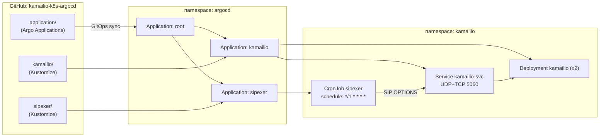

# Kamailio on Kubernetes with ArgoCD

[](https://kubernetes.io/)
[](https://argo-cd.readthedocs.io/)
[](https://www.kamailio.org/)
[](https://kustomize.io/)
[](https://datatracker.ietf.org/doc/html/rfc3261)
[](https://minikube.sigs.k8s.io/)
[](LICENSE)

> A minimal **lab project** that runs the [Kamailio](https://www.kamailio.org/) SIP server on Kubernetes,
> delivered with **GitOps** via Argo CD and continuously exercised by a
> [sipexer](https://github.com/miconda/sipexer) **CronJob**. Designed to be read top-to-bottom,
> spun up on Minikube in minutes, and torn down just as quickly.

## Table of Contents

1. [Overview](#overview)
2. [Architecture](#architecture)
3. [Repository Layout](#repository-layout)
4. [Prerequisites](#prerequisites)
5. [Quick Start](#quick-start)
6. [How It Works](#how-it-works)
7. [Load Testing with sipexer](#load-testing-with-sipexer)
8. [Troubleshooting](#troubleshooting)
9. [Cleanup](#cleanup)
10. [License](#license)

## Overview

This repo demonstrates four things glued together:

| Piece | Role |
|---|---|
| **Kamailio** | Open-source SIP proxy/router. Routes requests via an embedded Python script (KSR API). |
| **Kubernetes** | Hosts the proxy as a regular Deployment with UDP+TCP service. |
| **Kustomize** | `base/` + `overlays/` split so the overlay only sets replica count. |
| **Argo CD** | Watches this Git repo and reconciles the cluster (app-of-apps pattern). |
| **sipexer** | Lightweight Go SIP traffic generator running as a CronJob (every minute). |

The intent is **clarity over completeness** — no HPA, no NetworkPolicies, no TLS. Read the
manifests in a single sitting, change one thing, see the result on Minikube.

## Architecture



## Repository Layout

```
.
├── application/                  # Argo CD Applications
│   ├── root.yaml                 # App-of-apps; deploys the two below
│   ├── kamailio.yaml             # -> kamailio/overlays
│   └── sipexer.yaml              # -> sipexer/
├── kamailio/
│   ├── base/                     # Deployment, Service, ConfigMaps
│   │   ├── deployment.yaml
│   │   ├── service.yaml
│   │   ├── kamailio.cfg          # Listens on UDP+TCP 5060, hands off to Python
│   │   ├── kamailio3.py          # KSR module: request_route in Python
│   │   └── kustomization.yaml
│   └── overlays/
│       └── kustomization.yaml    # namespace=kamailio, replicas=2
├── sipexer/
│   ├── cronjob.yaml              # SIP load generator
│   └── kustomization.yaml
├── LICENSE
└── README.md
```

## Prerequisites

| Tool | Why |
|---|---|
| [Minikube](https://minikube.sigs.k8s.io/) | Local Kubernetes |
| [kubectl](https://kubernetes.io/docs/tasks/tools/) | Talk to the cluster |
| [argocd CLI](https://argo-cd.readthedocs.io/en/stable/cli_installation/) | Optional, for the login flow |

Install Minikube on Linux:

```sh
curl -LO https://storage.googleapis.com/minikube/releases/latest/minikube-linux-amd64
sudo install minikube-linux-amd64 /usr/local/bin/minikube
```

## Quick Start

```sh
# 1. Start Minikube
minikube start

# 2. Install Argo CD into its own namespace
kubectl create namespace argocd
kubectl apply -n argocd \
  -f https://raw.githubusercontent.com/argoproj/argo-cd/stable/manifests/install.yaml

# 3. Bootstrap the app-of-apps. Argo CD picks up everything else from Git.
kubectl apply -f application/root.yaml

# 4. Open the Argo CD UI (in a separate shell)
kubectl port-forward svc/argocd-server -n argocd --address 0.0.0.0 8080:443

# 5. Grab the initial admin password
kubectl -n argocd get secret argocd-initial-admin-secret \
  -o jsonpath="{.data.password}" | base64 -d ; echo

# 6. (Optional) LoadBalancer access from the host — keep this running
minikube tunnel
```

After a few seconds you should see three Applications healthy in the Argo CD UI:
`root`, `kamailio`, `sipexer`.

Reach the SIP service:

```sh
# Get the LoadBalancer IP (works once `minikube tunnel` is running)
kubectl -n kamailio get svc kamailio-svc

# Or just port-forward
kubectl -n kamailio port-forward svc/kamailio-svc 5060:5060
```

## How It Works

### kamailio.cfg

A deliberately tiny configuration. Two listeners (UDP + TCP, both on 5060), the essential
modules, and `cfgengine "python"` to delegate routing to the embedded Python module.

### kamailio3.py (KSR)

The `mod_init()` factory returns a `Kamailio` instance whose `ksr_request_route(msg)`
method is invoked for every SIP request. The demo logic is intentionally trivial:

- Replies `200 OK` to `OPTIONS` (so probes look healthy).
- Replies `200 OK` to any other allowed method, with the pod hostname in the reason phrase.
- Replies `405 Method Not Allowed` to anything else.

This is also the perfect place to start hacking — drop in registrar logic, NAT handling,
proxying to an upstream, whatever you want.

### Service

The service is `LoadBalancer` with both UDP and TCP entries on port 5060. Inside the cluster
sipexer reaches it as `kamailio-svc.kamailio.svc.cluster.local:5060`.

## Load Testing with sipexer

A CronJob fires [sipexer](https://github.com/miconda/sipexer) every minute against the
internal service:

```yaml
args:
  - "udp:kamailio-svc.kamailio.svc.cluster.local:5060"
```

Inspect the latest run:

```sh
kubectl -n kamailio get jobs
kubectl -n kamailio logs -l app.kubernetes.io/name=sipexer --tail=200
```

Run sipexer ad-hoc with a custom flag:

```sh
kubectl -n kamailio run sipexer --rm -it --restart=Never \
  --image=ghcr.io/denyspozniak/sipexer:latest -- \
  -register udp:kamailio-svc.kamailio.svc.cluster.local:5060
```

## Troubleshooting

**Tail Kamailio logs**

```sh
kubectl -n kamailio logs -l app.kubernetes.io/name=kamailio -f
```

**Drop a netshoot debug container next to a pod**

```sh
POD=$(kubectl -n kamailio get pod -l app.kubernetes.io/name=kamailio -o name | head -1)
kubectl debug -n kamailio "$POD" -it --image=nicolaka/netshoot
```

**Send a manual SIP OPTIONS via `sipsak`**

```sh
kubectl -n kamailio run sipsak --rm -it --restart=Never --image=nicolaka/netshoot -- \
  sipsak -s sip:test@kamailio-svc.kamailio.svc.cluster.local
```

**Force Argo CD to resync**

```sh
argocd app sync kamailio
argocd app sync sipexer
```

## Cleanup

```sh
kubectl delete -f application/root.yaml      # Removes both child apps
kubectl delete namespace kamailio argocd     # Nukes everything else
minikube stop                                # Optional
```

## License

Released under the [MIT License](LICENSE).
